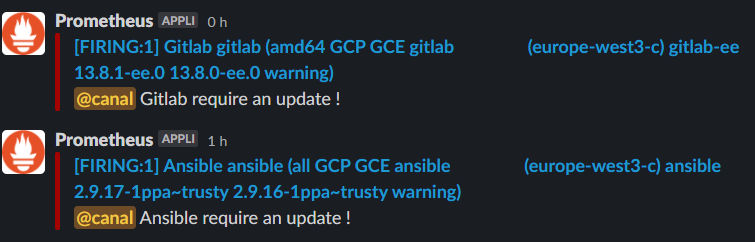

# Pushgateway APT PACKAGE UPDATE PENDING
## Utilisation
Use a crontab
```sh
0 */12 * * * <USER> apt_package_update_pending.sh | /usr/bin/curl -u pushgateway:<PASSWORD> --data-binary @- https://<URL>/metrics/job/<JOB_NAME>/instance/<INSTANCE_NAME> >/dev/null 2>&1
```
## Output format
Exemple
```
# HELP apt_package_update_pending Apt package pending updates by package.
# TYPE apt_package_update_pending gauge
apt_package_update_pending{name="tzdata",oversion="2020e-0+deb10u1",nversion="2021a-0+deb10u1",arch="all"} 1
apt_package_update_pending{name="ansible",oversion="2.9.16-1ppa~trusty",nversion="2.9.17-1ppa~trusty",arch="all"} 1
apt_package_update_pending{name="ca-certificates",oversion="20200601~deb10u1",nversion="20200601~deb10u2",arch="all"} 1
apt_package_update_pending{name="docker-ce",oversion="5:19.03.13~3-0~debian-buster",nversion="5:20.10.2~3-0~debian-buster",arch="amd64"} 1
apt_package_update_pending{name="docker-ce-rootless-extras",oversion="",nversion="5:20.10.2~3-0~debian-buster",arch="amd64"} 1
apt_package_update_pending{name="google-cloud-packages-archive-keyring",oversion="1.2-350029030",nversion="1.2-353676570",arch="all"} 1
apt_package_update_pending{name="google-cloud-sdk",oversion="322.0.0-0",nversion="325.0.0-0",arch="all"} 1
apt_package_update_pending{name="google-osconfig-agent",oversion="1:20201214.00-g1",nversion="1:20201229.01-g1",arch="amd64"} 1
# HELP node_reboot_required Node reboot is required for software updates.
# TYPE node_reboot_required gauge
node_reboot_required 0

```

## Grafana

## Alert rule


For alertmanager
Exemple in "/etc/prometheus/alerts/UpdateAvailable.yml"
```sh
groups:
- name: UpdateAvailable
  rules:
  - alert: UpdateAnsible
    expr: apt_package_update_pending{name="ansible"}
    for: 15s
    labels:
      severity: warning
    annotations:
      description: "Ansible require an update !"
  - alert: UpdateGitlab
    expr: apt_package_update_pending{name="gitlab-ee"}
    for: 15s
    labels:
      severity: warning
    annotations:
      description: "Gitlab require an update !"
```
## Sources
[https://github.com/prometheus-community/node-exporter-textfile-collector-scripts/blob/master/apt.sh](https://github.com/prometheus-community/node-exporter-textfile-collector-scripts/blob/master/apt.sh)